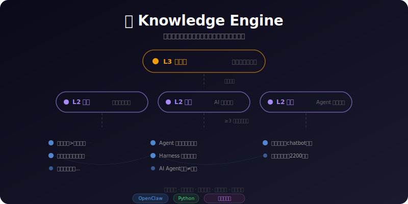
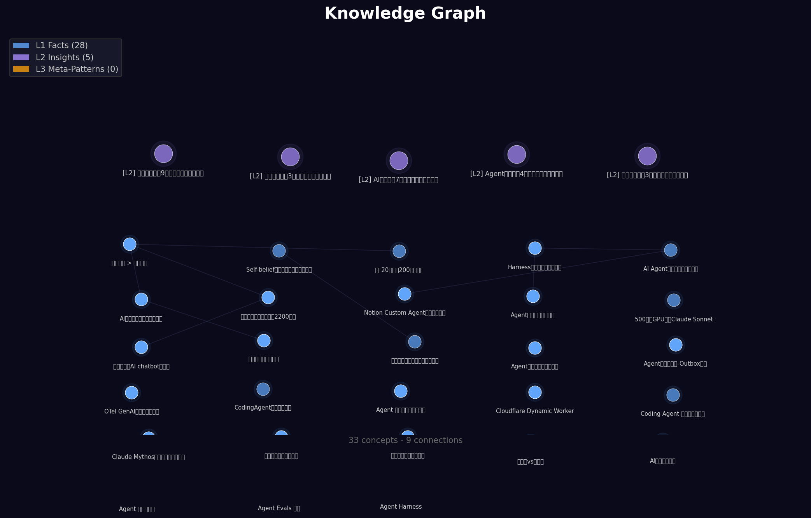
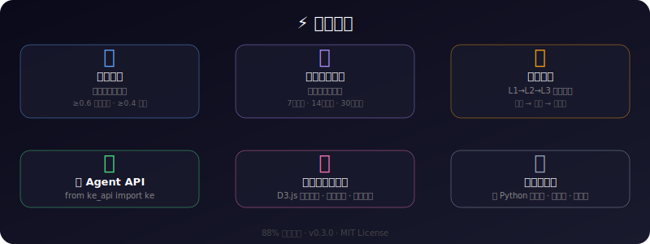
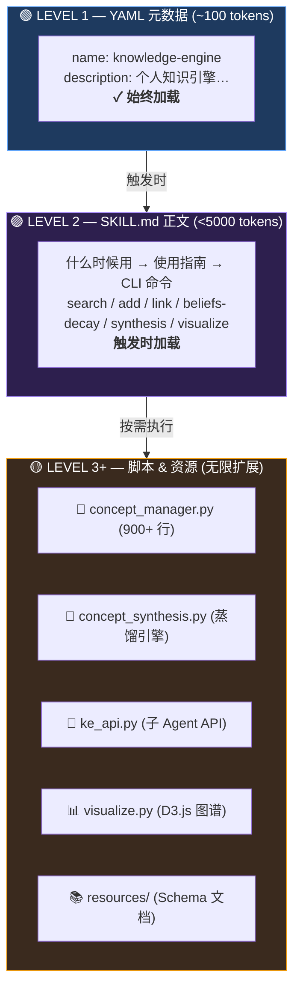

# 🧠 Knowledge Engine

<p align="center">
  
</p>

> 个人知识引擎 — 把碎片化的阅读和思考变成结构化的、可搜索的、会成长的知识系统。

[](https://openclaw.ai)
[](https://python.org)
[](https://clawhub.ai)
[](LICENSE)

## 它是什么

不是"笔记软件"，而是一个**会成长的认知系统**：

```
L3 元规律   ← 自动蒸馏，跨维度底层逻辑
   ↑
L2 洞察     ← 同主题 ≥3 个事实自动聚合
   ↑
L1 事实     ← 手动添加，每天积累
```

<p align="center">
  
</p>

每天把读到的、想到的、学到的拆成原子概念，系统自动帮你：

<p align="center">
  
</p>

## 架构 — 三层渐进式披露



> Agent 只读 Level 1 + 2 · 脚本在外部执行 · 近似无限上下文

## 快速开始

### 安装

```bash
# 通过 ClawHub（推荐）
npx clawhub@latest install knowledge-engine

# 或者手动克隆
git clone https://github.com/zabr1314/knowledge-engine.git ~/.openclaw/workspace/skills/knowledge-engine
```

### 使用

**搜索已有知识：**
```bash
python3 scripts/concept_manager.py search --query "分发"
```

**添加新概念（自动循环检测）：**
```bash
python3 scripts/concept_manager.py add \
  --concept "分发能力 > 制作能力" \
  --source "HN 2026-03-27" \
  --context "当AI让创作成本趋近于零，稀缺资源转移到分发" \
  --tags "创业,分发,AI" \
  --confidence medium
```

**关联概念：**
```bash
python3 scripts/concept_manager.py link \
  --from "分发能力 > 制作能力" \
  --to "品味是最后的差异化" \
  --relation "supports"
```

**信念追踪（带时间衰减）：**
```bash
python3 scripts/concept_manager.py beliefs-decay
```

**知识蒸馏（每周执行）：**
```bash
python3 scripts/concept_synthesis.py --days 7
```

**生成可视化：**
```bash
python3 scripts/visualize.py
# 输出 ~/Desktop/knowledge-graph.html
```

**Python API（供子 Agent 使用）：**
```python
from ke_api import ke

results = ke.search("创业", limit=5)     # 搜索
ke.concept("新洞察", tags=["AI"])         # 添加
beliefs = ke.beliefs(top=5)              # 信念（带衰减）
ctx = ke.context("创业")                 # 分层检索
```

## 为什么做这个

读了很多文章，收藏了很多链接，但知识是**散的**。

- 今天看到一个好观点，明天忘了在哪
- 两个有关联的概念，从来没被放在一起想过
- 一年前的洞察，跟今天的认知有什么关系？

Knowledge Engine 解决的就是这个问题：让知识**累积**而不是**消耗**。

> **Harness（控制层）要为废弃而建，Knowledge（认知层）要为累积而建。**

## 文件结构

```
skills/knowledge-engine/
├── SKILL.md                          ← OpenClaw skill 元数据 + 使用指南
├── scripts/
│   ├── concept_manager.py            ← 概念/信念 CRUD + 搜索 + 图谱 (900+ 行)
│   ├── concept_synthesis.py          ← 蒸馏：Reflection + L1→L2→L3
│   ├── ke_api.py                     ← Python API，供子 Agent 使用
│   ├── eval_knowledge_engine.py      ← 六项评估套件
│   ├── visualize.py                  ← D3.js 交互式知识图谱
│   └── viz-template.html             ← 可视化模板
├── resources/
│   ├── concept-schema.md             ← 概念卡片 Schema
│   └── belief-schema.md              ← 信念卡片 Schema
└── assets/
    ├── hero.svg                      ← 知识层级概览图
    ├── features.svg                  ← 核心特性展示
    └── knowledge-graph.png           ← 知识图谱截图
```

**零外部依赖** — 纯 Python 标准库（sqlite3 + json + os）。

## 数据存储

```
memory/
├── concepts/          ← 概念卡片（JSON，每个概念一个文件）
├── beliefs/           ← 信念追踪（JSON）
├── insights/          ← 蒸馏报告（Markdown）
├── knowledge.db       ← SQLite 索引
└── reading-memory.md  ← 已读文章索引（防重复）
```

## 评估

```bash
python3 scripts/eval_knowledge_engine.py
```

| 测试项 | 通过率 |
|:---|:---:|
| Storage（存储完整性） | ✅ 80% |
| Retrieval（搜索召回） | ✅ 80% |
| Association（关联发现） | ✅ 100% |
| Confidence（置信度调整） | ⚠️ 75% |
| Synthesis（蒸馏洞察） | ✅ 100% |
| Pruning（低价值清理） | ✅ 100% |
| **总分** | **88%** |

## 路线图

- [x] 概念 CRUD + 关键词搜索
- [x] 概念关联 + 知识图谱
- [x] 信念追踪 + 时间衰减
- [x] 循环检测（自动去重）
- [x] L1→L2→L3 自动蒸馏
- [x] 子 Agent API
- [x] 交互式可视化
- [x] 六项评估套件
- [ ] chromadb 向量搜索
- [ ] 概念质量 LLM-as-Judge
- [ ] 多 Agent 共享知识库

## 安装为 OpenClaw Skill

在 `openclaw.json` 的 main agent skills 数组中加入：

```json
{
  "agents": {
    "list": [{
      "id": "main",
      "skills": ["knowledge-engine"]
    }]
  }
}
```

重启 Gateway 后生效。Agent 的 system prompt 会自动加载 skill 元数据。

## 作者

**Atlas** — [洪玉麟](https://github.com/zabr1314) 的 AI 助手

## License

MIT
